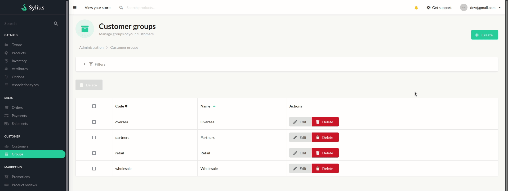
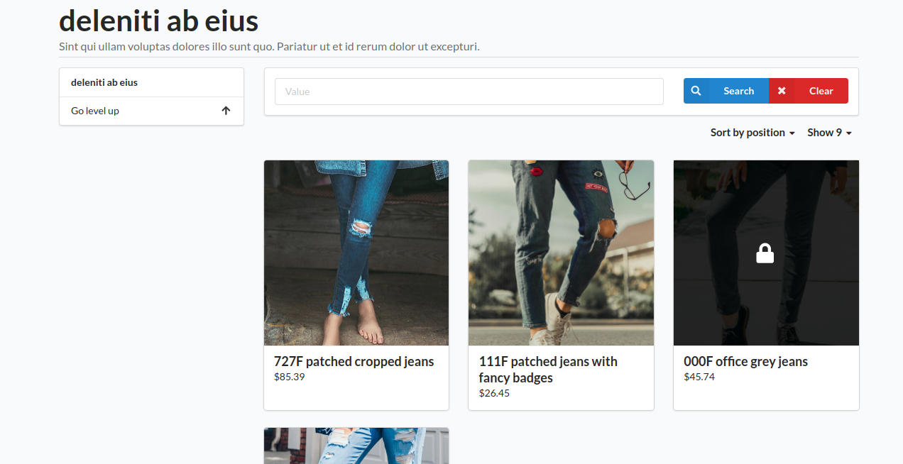

<p align="center">
</p>


<h1 align="center">Asdoria Product Product Customer Group Plugin</h1>

<p align="center">Manage which user can access certain Products by whitelisting Customer Groups for each item in your catalog </p>

## Features

+ Use your Customer Groups to filter which products your users can access
+ Create a whitelist of Groups for each product

<div style="max-width: 75%; height: auto; margin: auto">





</div>


<div style="max-width: 75%; height: auto; margin: auto">


Creating a Customer Group and setting which Groups are authorized to access a product


</div>

## Installation

---
1. Add the repository to composer.json

```JSON
"repositories": [
    {
    "type": "git",
    "url": "https://github.com/asdoria/AsdoriaSyliusProductCustomerGroup.git"
    }
],
```
2. run `composer require asdoria/sylius-product-customer-group-plugin`


3. Add the bundle in `config/bundles.php`. You must put it ABOVE `SyliusGridBundle`

```PHP
Asdoria\SyliusProductCustomerGroupPlugin\AsdoriaSyliusProductCustomerGroupPlugin::class => ['all' => true],
```

4.In `src/Entity/Product/Product.php`. Import the following classes, traits and methods.

```PHP
use Sylius\Component\Core\Model\Product as BaseProduct;

use Asdoria\SyliusProductCustomerGroupPlugin\Model\Aware\CustomerGroupsAwareInterface;
use Asdoria\SyliusProductCustomerGroupPlugin\Traits\CustomerGroupsTrait;

class Product extends BaseProduct implements CustomerGroupsAwareInterface
{
    use CustomerGroupsTrait;
    
    public function __construct()
    {
        parent::__construct();
        $this->initializeCustomerGroupsCollection();
    }
    
    ...
}
```
5.In `src/Entity/Customer/CustomerGroup.php`. Import the following classes, traits and methods.
```PHP
use Asdoria\SyliusProductCustomerGroupPlugin\Model\Aware\ProductsAwareInterface;
use Asdoria\SyliusProductCustomerGroupPlugin\Traits\ProductsTrait;
use Doctrine\ORM\Mapping as ORM;
use Sylius\Component\Customer\Model\CustomerGroup as BaseCustomerGroup;

/**
 * @ORM\Entity
 * @ORM\Table(name="sylius_customer_group")
 */
class CustomerGroup extends BaseCustomerGroup implements ProductsAwareInterface
{
    use ProductsTrait;
    public function __construct()
    {
        $this->initializeProductsCollection();
    }
    ...
}

```
6. run `php bin/console do:mi:mi` to update the database schema

7. Add the additional Product xml mapping in `src/Resources/config/doctrine/Product.orm.xml`
```XML
<?xml version="1.0" encoding="UTF-8"?>

<doctrine-mapping xmlns="http://doctrine-project.org/schemas/orm/doctrine-mapping"
                  xmlns:xsi="http://www.w3.org/2001/XMLSchema-instance"
                  xsi:schemaLocation="http://doctrine-project.org/schemas/orm/doctrine-mapping
                                      http://doctrine-project.org/schemas/orm/doctrine-mapping.xsd">
    
    <mapped-superclass name="Product">
        <many-to-many field="customerGroups" target-entity="Sylius\Component\Customer\Model\CustomerGroupInterface">
            <join-table name="asdoria_products_customer_groups">
                <join-columns>
                    <join-column name="product_id" referenced-column-name="id" />
                </join-columns>
                <inverse-join-columns>
                    <join-column name="customer_group_id" referenced-column-name="id" />
                </inverse-join-columns>
            </join-table>
        </many-to-many>
    </mapped-superclass>
    
</doctrine-mapping>
```

8. Copy the template override from the plugin directory

From: `[shop_dir]/vendor/asdoria/sylius-product-customer-group-plugin/src/Resources/views/bundles/SyliusShopBundle/Product/Box/_content.html.twig`

To: `[shop_dir]/templates/bundles/SyliusShopBundle/Product/Box/_content.html.twig`

Linux CMD : cp -r vendor/asdoria/sylius-product-customer-group-plugin/src/Resources/views/bundles/SyliusShopBundle/Product/Box templates/bundles/SyliusShopBundle/Product/Box

---
## Demo

If you want to try to create pictograms, go on [the admin authentication page](https://demo-sylius.asdoria.fr/admin/) and connect with:
> **Login:** asdoria <br>
> **Password:** asdoria
> 
Then go on ["Groups" in the back office](https://demo-sylius.asdoria.fr/admin/customer-groups/) and follow usage lines below.

Note that we have developed several other open source plugins for Sylius, whose demos and documentation are listed on the [following page](asdoria.github.io).

## Usage

1. Create or use existing Customer Groups
2. Go to a product's configuration page and enter the "Customer Groups" tab
3. Select any Group that will gain access to the product


